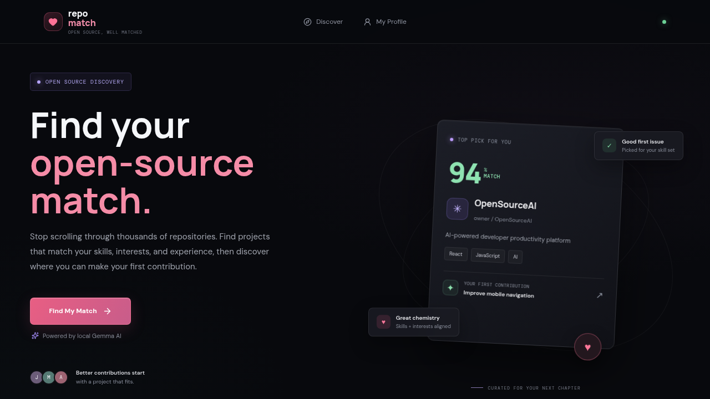
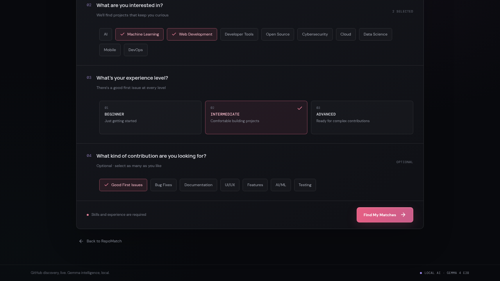
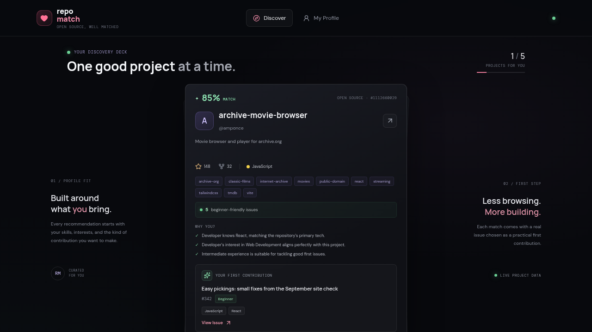

# RepoMatch

**Find the open-source project that actually fits your skills — and the exact issue to fix first.**

RepoMatch takes a short developer profile (skills, interests, experience) and
returns up to five live GitHub repositories that are actively welcoming new
contributors, ranked by fit, each paired with a real `good first issue` you
can open today.

Every repository, every issue title, and every issue link comes from the real
GitHub API. The reasoning behind each match is generated by **Gemma running
locally** through Ollama. No cloud LLM, no database, no scraped dataset.

**Live demo:** https://repomatch-pied.vercel.app

<!-- Replace the two images below with real screenshots once captured. -->

---

## Contents

- [Why this exists](#why-this-exists)
- [Quick start](#quick-start)
- [How it works](#how-it-works)
- [Why one topic per search](#why-one-topic-per-search)
- [API reference](#api-reference)
- [Live data only](#live-data-only-no-demo-mode)
- [Project layout](#project-layout)
- [Deploy the frontend on Vercel](#deploy-the-frontend-on-vercel)
- [Configuration](#configuration)
- [Verify](#verify)
- [Known limits](#known-limits)

---

## Why this exists

Most "find an open-source project" tools hand you a list of popular repos and
leave you to work out where to start. You land on a repo, hunt through 200
open issues, and find nothing labelled beginner-friendly.

RepoMatch answers the question you'd actually ask — **"where do I start?"**

- Every suggestion has an open `good first issue` — nothing to hunt for
- Issue **title and URL always come from GitHub**, never from the model. The
  model picks *which* issue; GitHub supplies its text and link, so a
  hallucinated issue number cannot produce a dead link
- Candidates are ranked by a deterministic rubric **before** the AI runs, so
  the model never wastes time on a repo the user can't contribute to
- Model output is stripped, clamped and validated before it reaches you. Any
  `<think>` block or reasoning trace is discarded

### In the UI

**Landing** — what RepoMatch is for:



**Profile** — pick skills, interests, experience level and contribution type:



**Results** — ranked matches, each with one real issue to open:



---

## Quick start

### Prerequisites

- **Node 18+**
- **[Ollama](https://ollama.com)** with the model:

```sh
ollama pull gemma4:e2b     # ~3.5 GB, first pull takes a while
```

### 1. Backend

```sh
cd backend
cp .env.example .env       # optional: add GITHUB_TOKEN, see Configuration
npm install
npm run dev                # http://localhost:3000
```

Verify it:

```sh
curl http://localhost:3000/api/health
# {"status":"ok","gemma":true,"ollama":true,"model":"gemma4:e2b"}
```

`gemma: false` means Ollama isn't running or the model isn't installed.

### 2. Frontend

```sh
npm install
npm run dev                # http://localhost:5173
```

Run these from the **repository root** — the Vite `package.json` is there, not
in a `frontend/` folder. The port is fixed at `5173` so the backend's CORS
allow-list keeps working.

The frontend reads `VITE_API_URL` and falls back to `http://localhost:3000`,
so no `.env` is needed for local work. To override, copy `.env.example` to
`.env.local`.

---

## How it works

```
  profile (skills, interests, experience)
      │
      ▼
  [1] validate              → 400 INVALID_PROFILE on bad input
      │
      ▼
  [2] cache lookup          10-minute in-memory cache, keyed by normalised profile
      │
      ▼
  [3] checkGemma()          → 503 GEMMA_UNAVAILABLE if Ollama/model down (~100 ms)
      │
      ▼
  [4] GitHub search         3 parallel /search calls, merged + deduped, ≤15 repos
      │                     → relaxed retry if the strict query matched nothing
      ▼
  [5] good-first issues     fetched for the top candidates only
      │                     → 503 GITHUB_* on failure (never returns unverifiable repos)
      ▼
  [6] deterministic pre-filter → top 5, scored on an explicit 0-100 rubric
      │
      ▼
  [7] Gemma analysis        one /api/chat call at a time, 90 s timeout each
      │                     → clamp score, verify issue against real GitHub data
      ▼
  [8] drop repos with no good-first issue, merge, sort by matchScore desc
      │
      ▼
  { repositories: [...], meta: { dataSource, aiSource, cached } }
```

### The pre-filter rubric

Defined in `backend/services/matchingService.js`:

| Signal | Weight |
| --- | --- |
| Skill / language match | 30 |
| Topic / interest match | 25 |
| Has open good-first issues | 20 |
| Recent activity | 10 |
| Star count (tiered by experience) | 15 |
| **Total** | **100** |

Only the top 5 survivors are sent to the model. This keeps the response fast
and stops Gemma from rationalising a repo that was never a realistic fit.

### Architecture

```
┌─────────────────┐   fetch    ┌──────────────────┐
│  Browser        │───────────▶│  Vercel          │
│  (React + Vite) │            │  static build    │
└─────────────────┘            └──────────────────┘
          │
          │ POST /api/matches
          ▼
┌─────────────────┐   tunnel   ┌──────────────────┐
│  ngrok          │◀───────────│  Express API     │
│  (public URL)   │            │  localhost:3000  │
└─────────────────┘            └──────────────────┘
                                        │
                                        ▼
                              ┌──────────────────┐
                              │  Ollama          │
                              │  gemma4:e2b      │
                              │  localhost:11434 │
                              └──────────────────┘
```

Plus, on every request: **GitHub REST API v3** for repositories and issues.

---

## Why one topic per search

GitHub **ANDs** repeated `topic:` qualifiers, which silently returns almost
nothing. Measured against the live API:

```
language:JavaScript topic:artificial-intelligence topic:web good-first-issues:>0  →  0 results
language:JavaScript good-first-issues:>0                                          →  643 results
topic:web good-first-issues:>0                                                    →  89 results
```

So each search targets **one** language or **one** topic, and results are
unioned at merge time. (`topic:a OR topic:b` is a validation error.) This one
detail is the difference between a working search and an empty one.

---

## API reference

All frontend requests go through `src/services/api.js` — the only module that
talks to the backend.

### `GET /api/health`

```json
{ "status": "ok", "gemma": true, "ollama": true, "model": "gemma4:e2b" }
```

### `POST /api/matches`

```json
{
  "skills": ["React", "TypeScript"],
  "interests": ["Developer Tools"],
  "experience": "beginner"
}
```

`experience` is one of `beginner`, `intermediate`, `advanced`. An empty or
missing value defaults to `beginner`.

Response:

```json
{
  "repositories": [
    {
      "id": 123456,
      "name": "repo",
      "fullName": "owner/repo",
      "owner": "owner",
      "description": "...",
      "url": "https://github.com/owner/repo",
      "stars": 1200,
      "forks": 34,
      "language": "TypeScript",
      "topics": ["react", "cli"],
      "goodFirstIssueCount": 4,
      "matchScore": 87,
      "whyMatch": ["Your React skill matches this project's stack", "…"],
      "summary": "A well-maintained CLI with an active contributor community.",
      "recommendedIssue": {
        "title": "Improve error message for missing config file",
        "number": 731,
        "url": "https://github.com/owner/repo/issues/731",
        "difficulty": "Beginner",
        "skills": ["TypeScript"]
      }
    }
  ],
  "meta": {
    "dataSource": "github",
    "aiSource": "gemma",
    "cached": false
  }
}
```

Repositories are sorted by `matchScore` descending. Optional fields are
rendered defensively by the UI.

### Errors

Every failure returns `{ "error": string, "code": string, "message": string }`.

| Status | Code | Meaning |
| --- | --- | --- |
| 400 | `INVALID_PROFILE` | `skills` missing/empty, or invalid `experience` |
| 400 | `INVALID_JSON` | body is not parseable JSON |
| 404 | `NOT_FOUND` | unknown `/api/*` path |
| 503 | `GEMMA_UNAVAILABLE` | Ollama down, or `gemma4:e2b` not installed |
| 503 | `GITHUB_RATE_LIMIT` | GitHub quota exhausted |
| 503 | `GITHUB_UNAVAILABLE` | GitHub unreachable or erroring |
| 500 | `INTERNAL_ERROR` | anything unexpected |

### `DELETE /api/cache` (development)

Clears the in-memory response and GitHub search caches.

---

## Live data only — no demo mode

**RepoMatch never returns fabricated repositories.**

An earlier version silently fell back to a hardcoded dataset whenever GitHub
failed, which presented invented repositories and issues to the user as real
recommendations. That fallback, and the `VITE_USE_MOCK_DATA` flag that fed it,
are gone.

Now:

- `meta.dataSource` is **always** `"github"`
- GitHub failures return `503` with a message naming the actual fix
- If the strict search matches nothing, a **relaxed** retry widens the
  qualifiers — drops the star floor and topic pins, extends the activity window
  to 12 months — but still requires `good-first-issues:>0`, so a narrow
  profile gets real repositories instead of an empty deck

The only thing that can degrade is the **scoring**, and only when Ollama is up
but an individual call misbehaves. Then `aiSource` is `"fallback"` and the
deterministic rubric is used — the repository data is still real.

---

## Project layout

```
.
├── src/                    React + Vite frontend
│   ├── App.jsx             profile form, results, error + empty states
│   ├── App.css             all styling
│   ├── components/         presentational components
│   └── services/
│       └── api.js          the only module that talks to the backend
├── backend/                Express API — runs locally
│   ├── server.js           app wiring, CORS, health route, error handler
│   ├── routes/
│   │   └── matchRoutes.js  the /api/matches pipeline + response cache
│   └── services/
│       ├── config.js       every tunable + env reading, in one place
│       ├── githubService.js GitHub search, issues, normalisation, TTL cache
│       ├── gemmaService.js  Ollama prompts, JSON parsing, output validation
│       ├── matchingService.js deterministic pre-filter (0-100 rubric)
│       └── httpError.js     one shared error envelope
├── docs/                   screenshots used by this README
├── vercel.json             static-build config for the frontend
└── .vercelignore           keeps backend/ and secrets out of the upload
```

Deeper backend reference: [`backend/README.md`](backend/README.md)

---

## Deploy the frontend on Vercel

Vercel serves the compiled React bundle only. **The backend and all AI stay on
the machine running Ollama**, because Vercel's serverless functions cannot
reach `localhost:11434`.

1. Import `hsay123/RepoMatch` into Vercel.
2. Set the project **root directory to `.`** — the Vite `package.json` is at the
   repository root.
3. Use the **Vite** framework preset, build command `npm run build`, output
   directory `dist`. Vercel can install dependencies with `npm install`.
4. Add `VITE_API_URL` to the project environment variables — the public backend
   origin, e.g. `https://your-tunnel.example.com`, with **no** trailing slash
   and **no** `/api` path. Apply to Production and Preview as needed, then
   redeploy.
5. On the backend host, set `CORS_ORIGINS` to the exact Vercel site origin, e.g.
   `https://your-project.vercel.app`. Add any custom domain too. Multiple
   origins are comma-separated. Preview deployments need their exact origins
   added, because the backend matches origins exactly.

`vercel.json` and `.vercelignore` in this repo already encode steps 2 and 3, and
exclude `backend/`, `node_modules` and `.env` from the upload.

> Keep `GITHUB_TOKEN` and every other secret on the **backend**. Never put one
> in a Vercel `VITE_*` variable — see [Configuration](#configuration).
>
> The backend's default `OLLAMA_URL=http://localhost:11434` refers to the
> **backend host**, never to a visitor's computer.

### Deploying the backend itself

Not supported as-is: it needs a long-lived Node process plus a reachable Gemma
instance, and Vercel's serverless model has neither. Host it on a small VM
alongside Ollama, or move the model to a hosted provider (which gives up the
"no cloud LLM" property).

### ⚠️ ngrok free-tier interstitial

If you publish the backend through a **free** ngrok account, be aware of this.
It was found by testing the deployed site in a real browser:

ngrok serves an HTML "warning" interstitial (`ERR_NGROK_6024`) for any `GET`
request carrying a browser `User-Agent`. That interstitial has **no CORS
headers**, so the browser blocks it and reports a misleading error:

> No 'Access-Control-Allow-Origin' header is present on the requested resource

| Request | Result |
| --- | --- |
| `POST /api/matches` | ✅ works — `POST` bypasses the interstitial |
| `GET /api/health` | ❌ blocked — the health badge reads "offline" |

Matching itself still works; only the status badge is affected. To fix it,
turn off the browser warning page for the tunnel in the
[ngrok dashboard](https://dashboard.ngrok.com) (Agent → Edges → HTTP), or use a
reserved domain / paid account. This is **not** a bug in this codebase — no
request header suppresses it, which is why the frontend adds no workaround
for it.

---

## Configuration

### Backend — `backend/.env` (gitignored)

| Variable | Default | Purpose |
| --- | --- | --- |
| `PORT` | `3000` | Express listen port |
| `GITHUB_TOKEN` | *(empty)* | Optional but strongly recommended — see below |
| `OLLAMA_URL` | `http://localhost:11434` | Ollama base URL, no trailing slash |
| `GEMMA_MODEL` | `gemma4:e2b` | Model tag to call |
| `CORS_ORIGINS` | `http://localhost:5173` | Comma-separated allowed origins |

### Frontend — `.env.local` (optional)

| Variable | Default | Purpose |
| --- | --- | --- |
| `VITE_API_URL` | `http://localhost:3000` | Backend origin the browser calls |

### 🔒 The `VITE_` prefix rule

**Vite compiles every `VITE_`-prefixed variable into the public JavaScript
bundle.** Anyone who opens the site can read it in DevTools.

| Variable | Where it lives | Public? |
| --- | --- | --- |
| `VITE_API_URL` | compiled into the browser bundle | **yes — by design** |
| `GITHUB_TOKEN` | `backend/.env`, gitignored | **no** |
| `GITHUB_TOKEN` as a Vercel env var | Vercel server-side only | **no** |

Never prefix a secret with `VITE_`.

### Why a GitHub token matters

Anonymous GitHub access allows **10 search requests/minute** and 60
requests/hour total. A single `/api/matches` call needs about 13, so you will
hit `503 GITHUB_RATE_LIMIT` almost immediately.

Create a token at <https://github.com/settings/personal-access-tokens> —
**public repository read access is enough**:

```sh
echo 'GITHUB_TOKEN=github_pat_...' >> backend/.env
```

With a token you get 5000 requests/hour and 30 searches/minute. The startup
banner prints `GITHUB_TOKEN : set` when it took effect.

---

## Verify

```sh
npm run build
npm run lint

cd backend
for f in server.js services/*.js routes/*.js; do node --check "$f" || exit 1; done
```

End-to-end against a running stack:

```sh
curl -X DELETE http://localhost:3000/api/cache
curl -X POST http://localhost:3000/api/matches \
  -H 'Content-Type: application/json' \
  -d '{"skills":["React"],"interests":["Web Development"],"experience":"beginner"}'
```

Expect `meta.dataSource` to be `"github"`, and every returned issue URL to
resolve to a real **open** GitHub issue labelled `good first issue`.

---

## Known limits

- **The first search takes 15–90 s.** Five sequential Gemma inferences plus live
  GitHub calls. Repeat searches on an identical profile return instantly from
  the 10-minute cache.
- **Gemma calls run one at a time by design,** to avoid overwhelming a local
  GPU. This is the main latency cost.
- **Model output is never trusted.** Scores are clamped to 0–100, `whyMatch` is
  coerced to a string array, and the recommended issue number is verified
  against the real issue list before use. Hallucinated numbers are corrected.
- **The deployed demo needs the backend machine awake.** The Vercel page loads
  anywhere, but searches only work while the host running Ollama, the backend
  and the tunnel are all up.
- **Anonymous GitHub access is tight.** Use a token.

---

## Tech

| Layer | Choice |
| --- | --- |
| Frontend | React 19, Vite 8, `lucide-react`, `oxlint` |
| Backend | Express 4, `cors`, `dotenv` — Node 18+, ES modules |
| Data | GitHub REST API v3 via native `fetch` (no SDK) |
| AI | Gemma via Ollama (`gemma4:e2b`), local inference |
| Hosting | Vercel (static frontend only) |

No database. No authentication. No cloud LLM APIs. Three runtime dependencies
on the backend, by design.